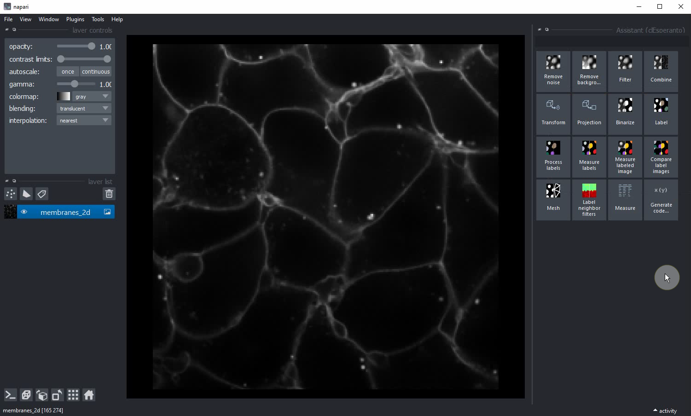
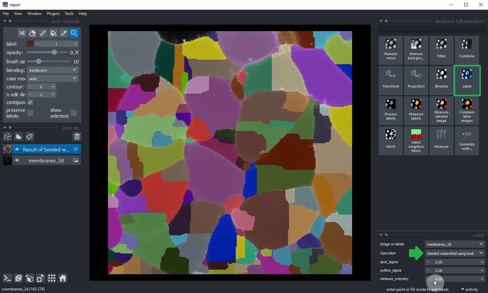
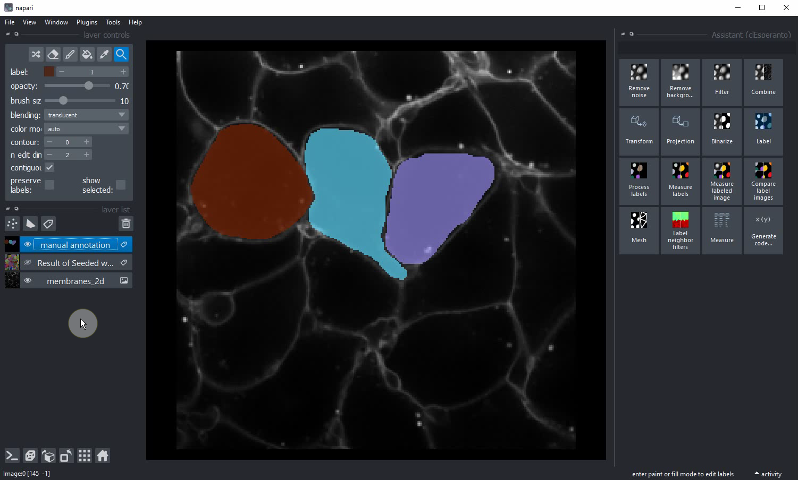
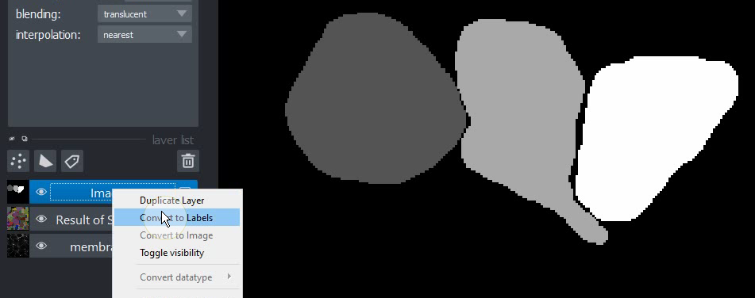
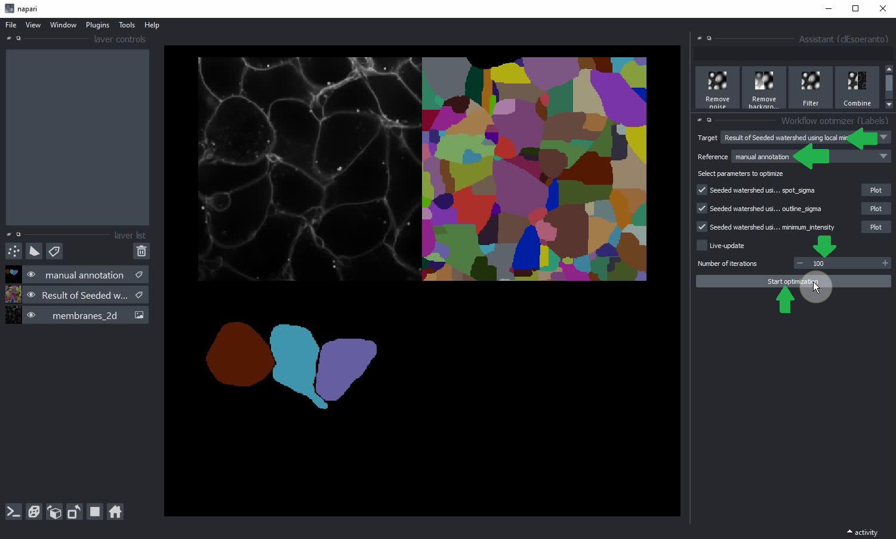
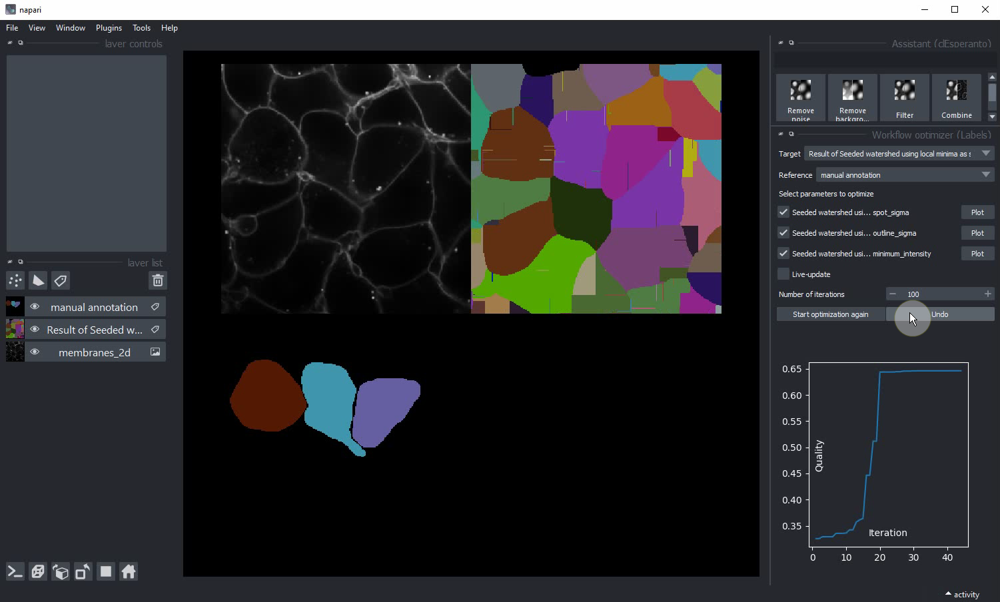
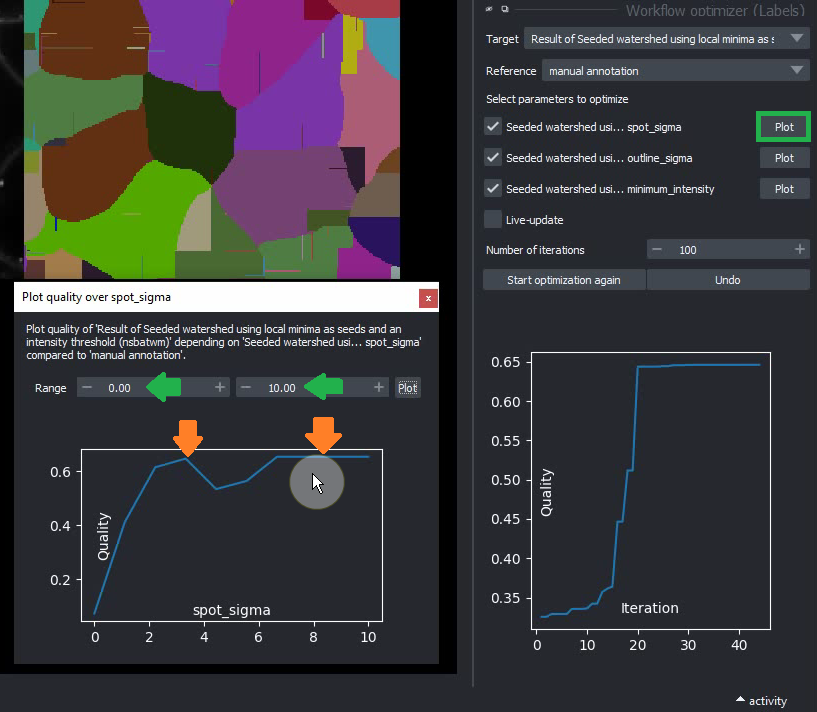
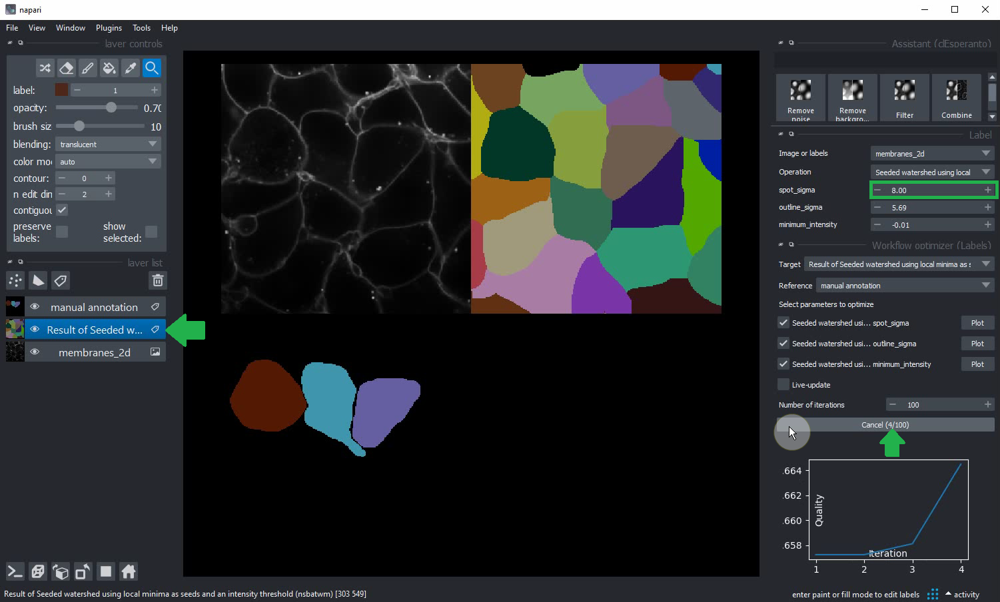
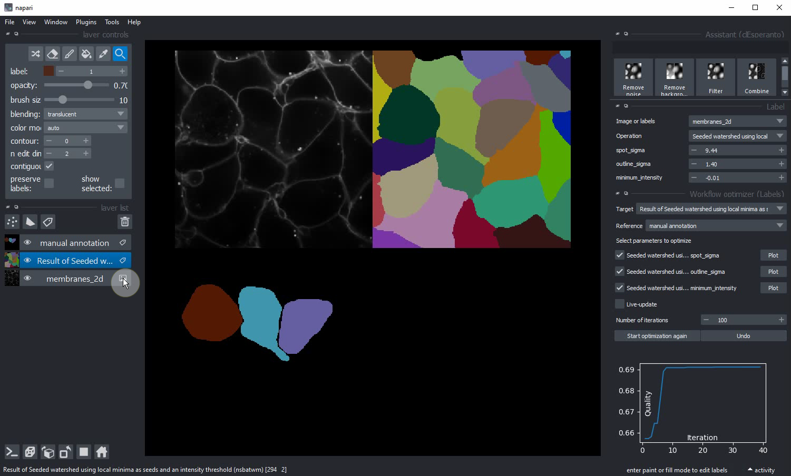
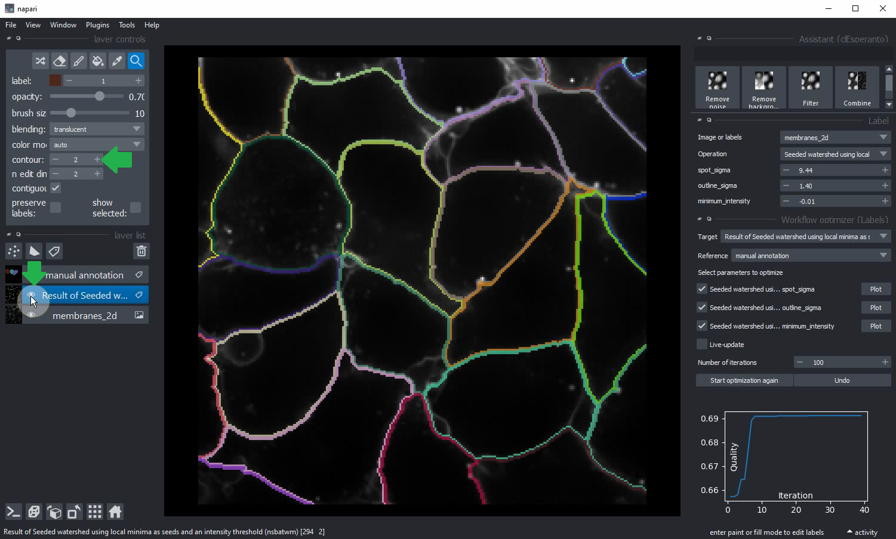

# napari-workflow-optimizer

[](https://github.com/haesleinhuepf/napari-workflow-optimizer/raw/main/LICENSE)
[](https://pypi.org/project/napari-workflow-optimizer)
[](https://python.org)
[](https://github.com/haesleinhuepf/napari-workflow-optimizer/actions)
[](https://codecov.io/gh/haesleinhuepf/napari-workflow-optimizer)
[](https://napari-hub.org/plugins/napari-workflow-optimizer)

Optimize image processing workflows in napari for segmentation quality


[Download full 2:00 movie](docs/napari-workflow-optimizer.mp4)

## Usage

The starting point for workflow optimization is a workflow and some reference ("ground truth") labels image. 
The label image can be a sparse annotation, which means only some objects and also parts of objets are annotated (see [hints](https://github.com/haesleinhuepf/napari-workflow-optimizer#optimization-hints)). 
These datasets should be ready. You can reproduce the following procedure by downloading an 
[examle raw image](https://github.com/haesleinhuepf/napari-workflow-optimizer/blob/main/demo/membranes_2d.tif) (derived from the 
[scikit-image cells3d example data set](https://scikit-image.org/docs/dev/api/skimage.data.html#skimage.data.cells3d)) and a corresponding 
[sparse annotation label image](https://github.com/haesleinhuepf/napari-workflow-optimizer/blob/main/demo/membranes_2d_sparse_labels.tif).
For reproducing the following procedure, also follow the [installation instructions](https://github.com/haesleinhuepf/napari-workflow-optimizer#optimization-hints) below.

### Step 0: Loading data and setting up the workflow

Load the "membranes_2d.tif" data set, e.g. by drag&drop on napari and start the Assistant from the `Tools > Utilities > Assistant (clEsperanto)` menu.



Click the `Label` button and select as operation "Seeded watershed using local minima as seeds and an intensity threshold (nsbatwm)".



Draw an annotation in a new labels layer or load the example spare annotation "membranes_2d_sparse_labels.tif". 



In case the image is not displayed as label image, convert it to a label image by right-clicking on the entry in the layers list:



### Step 1: The Workflow Optimizer

Start the Workflow Optimizer from the `Tools > Utilities > Workflow optimizer (Labels)` menu. 
Configure the target layer, showing the label image that should be optimized.
Select the manual annotation as reference layer for the optimization. 
Consider increasing the number of iterations. This number depends on your segmenation problem. 
In the present example, 100 iterations should be enough.



The optimizer will plot quality over the number of iterations to show the progress of optimization. 
To determine the quality, the optimizer will measure the maximum overlap ([Jaccard index](https://en.wikipedia.org/wiki/Jaccard_index)) 
of any labeled object over the manually annotated objects and calculate the mean of this value over all annotated objects.
After a moment, optimization will finish and update the labeled image. 
If your starting point for the optimization was already good, the result may now look better than before.



### Step 2: Manual parameter space plotting

In case the result is not perfect yet (as the fringed segmentation above suggests), consider manual plotting of the 
individual parameters and their relation to segmentation quality to get an idea about the surrounding parameter space.
Therefore, click the `Plot` button next to one of the workflow parameters.
Select the range in which the labeling quality should be determined (green arrows). In our example, the optimizer was setting the parameter to 2.34. 
Thus, to demonstrate the procedure we plot the parameter space beween 0 and 10. 
The quality plotted over this parameter obviously has a local maxium at 2.34, which was detected by the optimizer.
However, it also has another local maxium at 8 and actually a plateau in the quality plot (orange arrows).



For further optimization, we re-configure the algorithm and set a new starting point for optimization of the parameter to 8.
Afterwards, we restart the optimization. It will then optimize the settings again from the new starting point.



After another moment, optimization will finish again, potentially leading to an even better result.



### Step 3: Visualization of result

Make sure the segmentation has high quality by inspecting the result visually. Use the `contour` setting of the labels layer
and hide/show the outlines of the labeled layer:




### Optimization Hints

The Workflow Optimizer uses the [Nelder-Mead simplex method](https://en.wikipedia.org/wiki/Nelder%E2%80%93Mead_method)
for optimizing parameters. This algorithm varies individual parameters and makes steps in the parameter space ideally following a gradient 
to a local optimum. Hence, this algorithm may not be capable of determining a global optimum in parameter space. 
Parameter optimization is no magic. If it does not immediately work on your data, plot the parameters as introduced in Step 2 
and identify parameters with a clear gradient and those with many local maxima. 
Consider optimizing the parameters with many local maxima manually and de-selecting their checkboxes for the optimization.
The optimizer will then only optimize the parameters showing the clear gradient. 
Repeat these steps a couple of times to get a feeling for your parameter space. 

Furthermore, parameter optimization works well if
* the initial settings are close to a good segmentation,
* a small number of parameters (a short workflow) are optimized and
* the reference annotation is prepared carefully.

### Workflow optimization scripting

For optimizing workflows from within a jupyter notebook, check out our [example notebook for optimization using spare labels](https://github.com/haesleinhuepf/napari-workflow-optimizer/blob/main/demo/sparse_label_image_optimizer.ipynb). 
The examples are more flexible than the graphical user interface and allow for example [optimizing intensity images](https://github.com/haesleinhuepf/napari-workflow-optimizer/blob/main/demo/intensity_image_optimizer.ipynb)
and [binary images](https://github.com/haesleinhuepf/napari-workflow-optimizer/blob/main/demo/binary_image_optimizer.ipynb).
The membrane segmentation workflow optimization similar to the one shown above is also available as [jupyter notebook](https://github.com/haesleinhuepf/napari-workflow-optimizer/blob/main/demo/membrane_segmentation.ipynb).

### Known issues

If you change the workflow architecture after the optimizer window was opened, please re-open it
to select the parameters that should be optimized. Changing parameters is ok and re-opening is not necessary.

----------------------------------

This [napari] plugin was generated with [Cookiecutter] using [@napari]'s [cookiecutter-napari-plugin] template.

## Installation

## Installation

Furthermore, to reproduce the procedure above, please download and install 
[napari](https://napari.org/),
[pyopencl](https://documen.tician.de/pyopencl/),
the [napari-pyclesperanto-assistant](https://www.napari-hub.org/plugins/napari-pyclesperanto-assistant) and
the [napari-segment-blobs-and-things-with-membranes](https://www.napari-hub.org/plugins/napari-segment-blobs-and-things-with-membranes) plugin. E.g. using 
[conda](https://docs.conda.io/en/latest/) and [pip](https://pypi.org/project/pip/):\

```
conda create --name napari-opti python=3.8
conda activate napari-opti
conda install pyopencl napari
pip install napari-pyclesperanto-assistant napari-segment-blobs-and-things-with-membranes
pip install napari-workflow-optimizer
```

## Contributing

Contributions are very welcome. Tests can be run with [tox], please ensure
the coverage at least stays the same before you submit a pull request.

## License

Distributed under the terms of the [BSD-3] license,
"napari-workflow-optimizer" is free and open source software

## Issues

If you encounter any problems, please [file an issue] along with a detailed description.

[napari]: https://github.com/napari/napari
[Cookiecutter]: https://github.com/audreyr/cookiecutter
[@napari]: https://github.com/napari
[MIT]: http://opensource.org/licenses/MIT
[BSD-3]: http://opensource.org/licenses/BSD-3-Clause
[GNU GPL v3.0]: http://www.gnu.org/licenses/gpl-3.0.txt
[GNU LGPL v3.0]: http://www.gnu.org/licenses/lgpl-3.0.txt
[Apache Software License 2.0]: http://www.apache.org/licenses/LICENSE-2.0
[Mozilla Public License 2.0]: https://www.mozilla.org/media/MPL/2.0/index.txt
[cookiecutter-napari-plugin]: https://github.com/napari/cookiecutter-napari-plugin

[file an issue]: https://github.com/haesleinhuepf/napari-workflow-optimizer/issues

[napari]: https://github.com/napari/napari
[tox]: https://tox.readthedocs.io/en/latest/
[pip]: https://pypi.org/project/pip/
[PyPI]: https://pypi.org/
