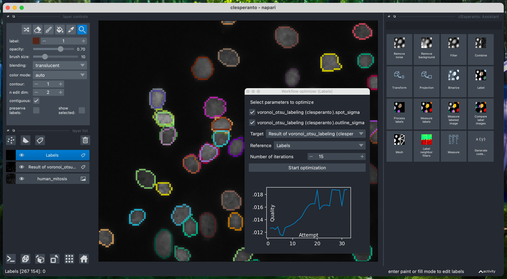
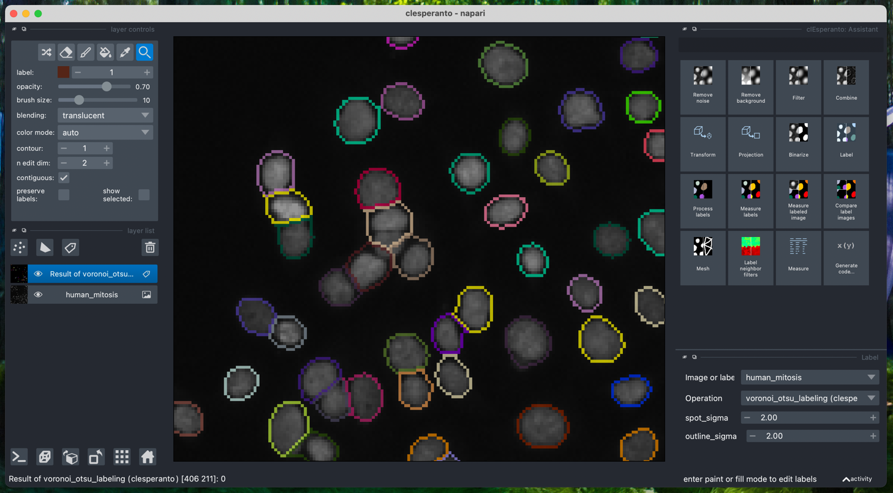
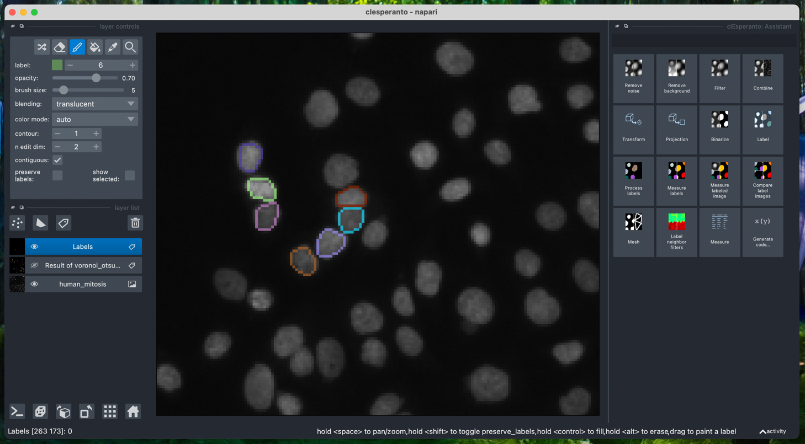
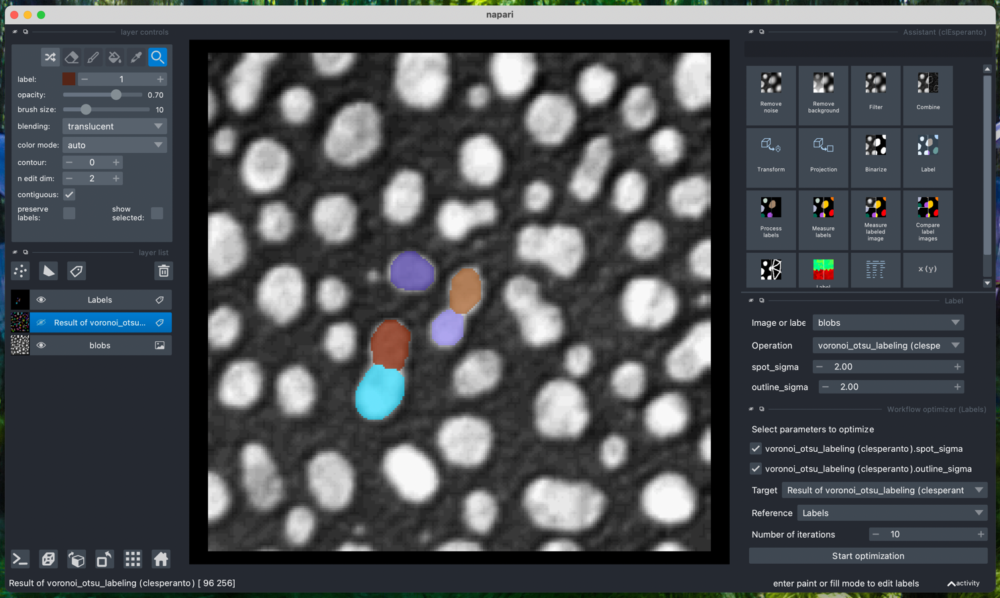
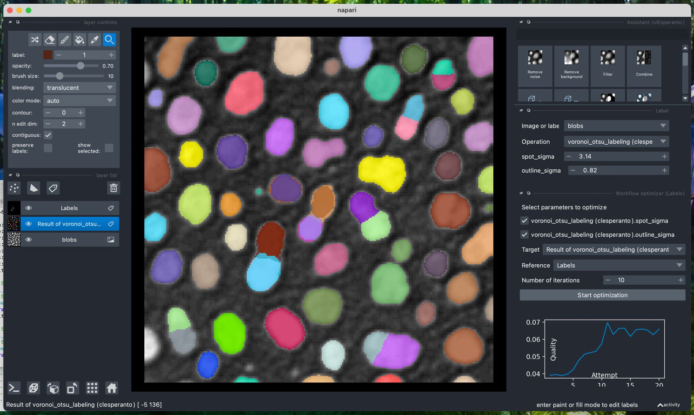
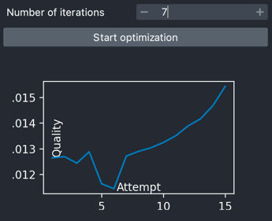
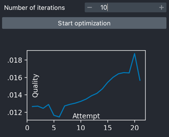
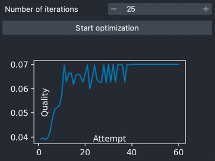
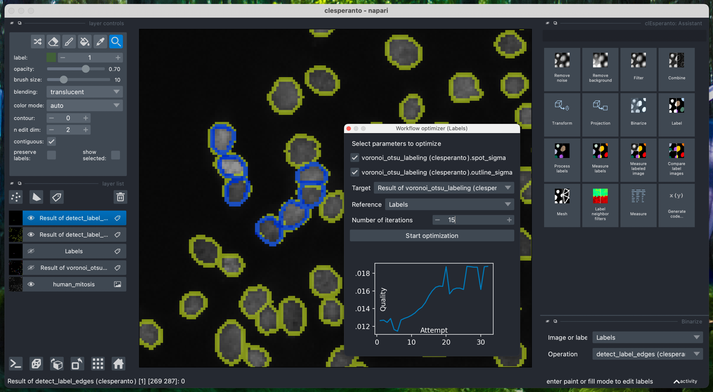

# napari-workflow-optimizer

Optimize image processing workflows in napari for segmentation quality

## Usage

The starting point for workflow optimization is a workflow and some reference ("ground truth") labels image. 
Setup a workflow, e.g. using the [napari-pyclesperanto-assistant](https://www.napari-hub.org/plugins/napari-pyclesperanto-assistant).
As an example, you can open `File > Open Samples > scikit-image > Human mitosis`, 
start the assistant from `Tools > Utilities > Assistant (clEsperanto)` and click the `Label` button. 
You should then see a segmentation result that is cutting objects where it shouldn't. 
The labels layer show an over-segmented result:

You could now manually optimize the parameters of the `Voronoi-Otsu-Labeling` algorithm in the bottom right 
corner of the window. You can also use the menu `Tools > Utilities > Workflow Optimizer (Labels)` to do this optimization automatically.
Therefore, you need a "sparse" manual annotation of your target objects. 
Therefore, hide the current `Result of voronoi_otsu_labeling` layer, add another labels layer and annotate some (sparse) objects.

Start `Tools > Utilities > Workflow Optimizer (Labels)` and select the `Target` layer that should be optimized and your annotated `Reference` layer.

After clicking `Start optimization` and waiting a bit, show the `Result of voronoi_otsu_labeling` layer again and inspect the segmentation and the optimized parameters.

### Number of iterations

How many iterations are necessary for the optimization depends on the workflow that's optimized and the number of parameters that the workflow has.
In general, it is recommended to start with a low number of iterations. 
For example, if you enter `7` iterations in the example shown above, you will see that the optimizer makes 11 attempts and
the quality is increasing:

When increasing the number of iterations to `10` (and after resetting the parameters to `2` and `2` to start from the same settings), 
the attempt-quality plot suggests an optimal solution is found before the `10` iterations were reached:

Further increasing the number of iterations, e.g. to `25` (and resetting parameters), may not help further improving the segmentation result:

### Optimization Hints

Parameter optimization works well if
* the initial settings are close to a good segmentation,
* a small number of parameters are optimized and
* the reference annotation is prepared carefully.

If you change the workflow architecture after the optimizer window was opened, please re-open it
to select the parameters that should be optimized. Changing parameters is ok and re-opening is not necessary.

For visualization of a labeling result compared to a manual annotation, consider using the `Detect label edges` operation from the 
assistant's `Binarize` category. It will draw outlines of labels and with the `Shuffle colors` button of the labels layer, you can
visualize both edge images in different colors: 

----------------------------------

This [napari] plugin was generated with [Cookiecutter] using [@napari]'s [cookiecutter-napari-plugin] template.

## Installation

You can install `napari-workflow-optimizer` via conda and [pip]:

    conda install pyopencl
    pip install napari-workflow-optimizer

## Contributing

Contributions are very welcome. Tests can be run with [tox], please ensure
the coverage at least stays the same before you submit a pull request.

## License

Distributed under the terms of the [BSD-3] license,
"napari-workflow-optimizer" is free and open source software

## Issues

If you encounter any problems, please [file an issue] along with a detailed description.

[napari]: https://github.com/napari/napari
[Cookiecutter]: https://github.com/audreyr/cookiecutter
[@napari]: https://github.com/napari
[MIT]: http://opensource.org/licenses/MIT
[BSD-3]: http://opensource.org/licenses/BSD-3-Clause
[GNU GPL v3.0]: http://www.gnu.org/licenses/gpl-3.0.txt
[GNU LGPL v3.0]: http://www.gnu.org/licenses/lgpl-3.0.txt
[Apache Software License 2.0]: http://www.apache.org/licenses/LICENSE-2.0
[Mozilla Public License 2.0]: https://www.mozilla.org/media/MPL/2.0/index.txt
[cookiecutter-napari-plugin]: https://github.com/napari/cookiecutter-napari-plugin

[file an issue]: https://github.com/haesleinhuepf/napari-workflow-optimizer/issues

[napari]: https://github.com/napari/napari
[tox]: https://tox.readthedocs.io/en/latest/
[pip]: https://pypi.org/project/pip/
[PyPI]: https://pypi.org/
